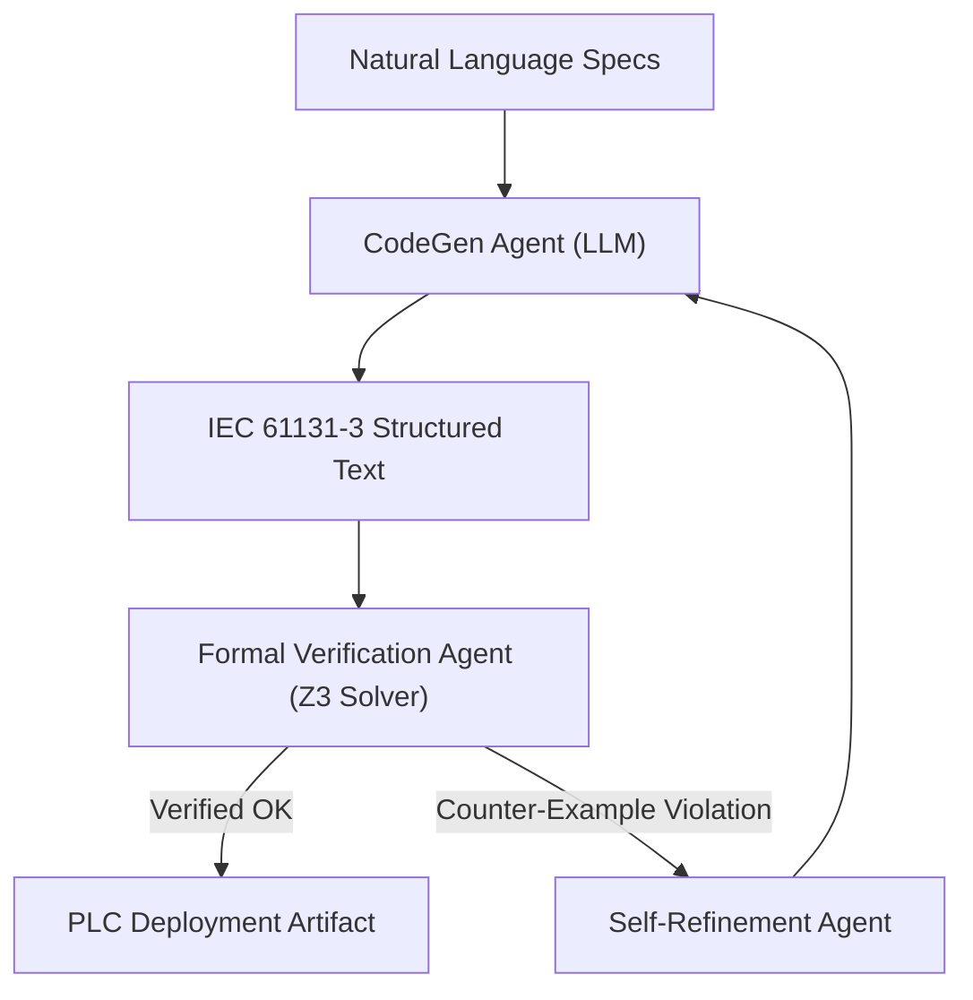

# System Architecture Document — PLC-AgentOS

**Project Name:** PLC-AgentOS  
**Author:** Nachiket Gadilohar  

---

## 1. System Architecture Diagram

```mermaid
graph TB
    Spec["Natural Language Specs"] --> CodeGen["CodeGen Agent (LLM)"]
    CodeGen --> STCode["IEC 61131-3 Structured Text"]
    STCode --> Verifier["Formal Verification Agent (Z3 Solver)"]
    Verifier -->|"Verified OK"| Export["PLC Deployment Artifact"]
    Verifier -->|"Counter-Example Violation"| Refiner["Self-Refinement Agent"]
    Refiner --> CodeGen
```
